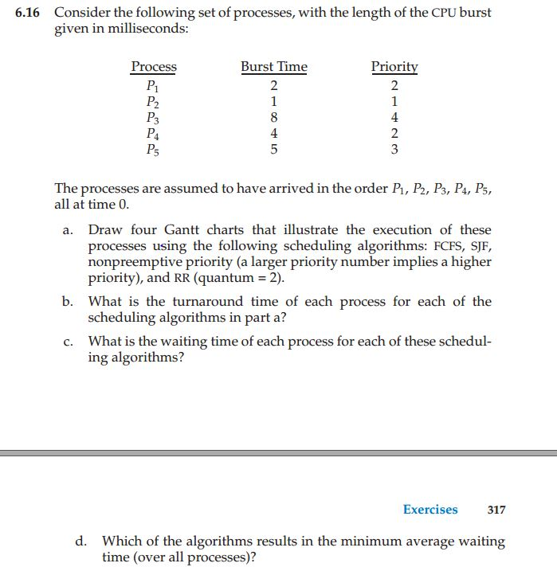

<h1> OPERATING SYSTEM REVIEW QUESTIONS </h1>

*The followings are the list of solutions for the final exam review question*

# Chapter 1: Introduction

## Review question 
- 1.2 *Provide at least three resources the operating system allocate*
    - CPU time, memory space, file-storage space, I/O devices
- 1.5 *What is an interrupt?*
    - A signal sent from either hardware or software the stops a CPU from performing its current action and transfers execution to a fixed location (interrupt vector) in order to perform a specific service routine
- 1.17 *What are the two separate modes of operation?*
    - User and kernel
- 1.31 *Provide an example of an open source operating system*
    - Linux
    - BSD Unix
    - Solaris
 ## Exercise
- 1.1 *What are three main purposes of an operating system?*
    - Manage system resources
    - Control execution of application software
    - Make it easier for users to interact with computers
- 1.10 *Give two reasons why caches are useful. What problems do they solve? What problems do they cause? If a cache can be made as large as the device for which it is caching (for instance, a cache as large as a disk), why not make it that large and eliminate the device?*
    - Caches are useful when two or more components need to exchange data, and that components perform transfers at different speeds. Caches solve the problem by providing a buffer of intermediate speed between the components. If fast device find data it need in the cache, it doesn't have to wait for the slow devices.
    - The problem it has is the data in the cache must be consistent with the data in the components. If the data component change the value, that data in cache must be updated as well (Additional level of coherency and consistency assurance). Additionally, we also incur an economic and space (at the computer organization level) penalty when we add a cache. 
    - Making a cache as large as a disk would be ineffective because it would be too costly to setup a equal-size-cache as disk. Moreover, data on disks are required to be persistent while cache is generally a volatile memory.
# Chapter 2: Operating System Structure
## Review Question
- 2.4 *What is a system call?*
    - Is an interface to the services made available by an operating system.
- 2.7 *List at least three of the major categories of system calls.*
    - Process control
    - File manipulation
    - Device manipulation
    - Information maintenance
    - Communication
    - Protection
- 2.14 *List at least three different ways of structuring an operating system.*
    - Monolithic
    - Layered
    - Microkernel
    - Modular
    - Hybrid
- 2.16 *What are the two devices that run the IOS operating system?*
    - Iphone
    - Ipad
## Exercise
- 2.1 *What is the purposes of system call?*
    - System call allow user-level processes to request services of opearing system.
- 2.13 *Describe the three general methods of passing parameters to operating system.*
    - Pass the parameters in registers (this way prove insufficient when there are more parameters than registers).
    - Store the parameter in a block or table in memory and pass the address of block to the register (This approach is used by Linux and Solaris).
    - Push the parameters onto a stack to be popped off by the OS. (This approach does not limit the number of length of parameters passed).
# Chapter 3: Processes
## Review Question
- 3.1 *What are the four components of a process?*
    - Stack
    - Heap
    - Data
    - Text 
- 3.2 *Provide at least three possible states a process maybe in.*
    - New
    - Ready
    - Waiting
    - Running
    - Terminated
- 3.7 *What is the degree of multiprogramming?*
    - The maximum number of process in memory controlled by the long term scheduler.
- 3.15 *What are the two fundamental models of interprocess communication?*
    - Independent
    - Cooperating
  ## Exercise
- 3.1 *Using the program shown in Figure 3.30, explain what the output will be at Line A*
    - 
    - The result is still 5 as the child updates it copied value. When control return to parent, the value is remain at 5.
- 3.2 *Including the initial parent process, how many processes are created by the program shown in Figure 3.31?*
    - 
    - There are 8 processes created.
- 3.5 *When a process creates a new process using fork() operation, which of the following state (stack, heap, shared memory segments) is shared between the parent processes and the child processes ?*
    - Only the shared memory segments are shared between the parent process and newly fork child processes. Copies of the stack and the heap are make for the newly created processes.
- 3.14 *Using the program in Figure 3.34, identify the values of pid at lines A, B, C and D. (Assume that the actual pids of the parent and child are 2600, and 2603 respectively)*
    - 
    - A = 0
    - B = 2603
    - C = 2603
    - D = 2600
    
 # Chapter 4: Threads
 ## Review Question
 - 4.2 *Provide at least three benefits of multithreaded programming*
    - Responsiveness
    - Resource sharing
    - Economy
    - Scalability
- 4.6 *What are the two general types of parallelism?*
    - Data parallelism - focuses on distributing subsets of the same data across multiple computing cores and performing the same operation on each core.
    - Task parallelism - involves distributing tasks across multiple computing cores.
- 4.7 *List three common ways of mapping user thread to kernel thread*
    - Many-to-one
    - One-to-one
    - Many to many
- 4.10 *What are three main thread libraries in use?*
    - POSIX PTHREADS
    - Windows Threads
    - Java
## Exercise
- 4.1 *Provide three programming examples in which multithreading provides better performance than a single-thread solution.*
    - A Web server that services each request in a separate thread.
    - A parallelized application such as a matrix multiplication where different part of the matrix may be work on in parallel.
    - An interactive GUI program such as a debugger where a thread is used to monitor user input, another thread represents the running application, and the third thread monitors performance. 
- 4.2 *What are two differences between user-level threads and kernel-level threads? Under what circumstances is one type better than the other?*
    - User-level threads are unknown by the kernel, whereas kernel is aware if kernel threads
    - On system using either M:1 or M:M mapping, user threads are scheduled by the thread library and the kernel schedules kernel threads.
    - Kernel thread need not be associated with a process whereas every user thread belongs to a process. Kernel threads are generally more expensive to maintain than user threads as they must be represented with a kernel data structure.
- 4.8 *Which of the following components of program state (Register values, Heap memory, Global variables, Stack memory) are shared across threads in a multithreaded process?*
    - Heap memory
    - Stack Variables
- 4.15 *Consider the following code segment:*
- a. How many unique processes are created?
- b. How many unique threads are created?
    - 
    - There are 5 unique processes and 2 unique threads are created
# Chapter 5: Process Synchronization
## Review Question
- 5.2 *What is the term for describing the situation where shared data maybe manipulated concurrently and the outcome of executuion depends upond the order of access?*
    - Race condition
- 5.3 *What is the term used to describe the segment of code where shared data is accessed and possibly manipuldated?*
    - Critical section
- 5.4 *What are three requirements to a solution to the critical-section problem must satisfy?*
    - Mutual Exclusion
    _ Progress
    _ Bounded Waiting
- 5.25 *What are the four necessary conditions for characterizing deadlock?*
    - Mutual exclusion: The resources involved must be unsharable; otherwise, the processes would not be prevented from using the resource when necessary.
    - Hold and wait or partial allocation: The processes must hold the resources they have already been allocated while waiting for other requested resource. If the process had to release its resources when a new resources were requested, deadlock could not occur because the processes would not prevent others from using resources that it control.
    - No pre-emption: The processes must not have resources taken away while that resource is being used. Otherwise, deadlock could not occur since the operating system could simply take enough resources from running processes to enable any processes to finish.
    - Resource waiting or circular wait: A circular chain of processes with each process holding resources which are currently being requested by the next orcess in the chain, cannot exist. Otherwise,the cycle theorem (which states that "a cycle in the resource graph is necessary for deadlock to occur") indicated that deadlock could occur.
## Exercise
- 5.3 *What is the meaning of the term busy waiting? What other kinds of waiting are there in an operating system? Can busy waiting be avoided altogether? Explain your answer.*
    - Busy waiting means that a process is waiting for a condition to be satisfied in a tight loop without relinquishing the processor. Alternatively, a process could wait by relinquishing the processor, and block on a condition and wait to be awakened at some appropriate time in the future. Busy waiting can be avoided but incurs the overhead associated with putting a process to sleep and having to wake it up when an appropriate program state is reached.
- 5.7 *List three examples of deadlocks that are not related to a computer system environment.*
    - Two cars crossing a single-lane brigde from opposite direction.
    - A person going down a ladder while another person is climbing up the ladder.
    - Two train traveling toward each other on the same track.
- 5.8 *Is it possible to have a deadlock involving only a single process? Explain your answer.*
    - No. it follows directly from the hold-and-wait condition.
- 5.10 *The first known correct software solution to the critical-section problem for two processes was developed by Deckker. The two processes, P0 and P1, share the following variables:*
    - ``boolean flag[2]; /* initially false*/
int turn;``
- The structure of process Po (i == 0 or 1) is shown in Figure 5.25. The other process is Pj (j == 0 or 1). Prove that the algorithm satisfies all three requirements for the critical-section problem
    - 
       - Mutual exclusion: is ensured through the use of flag and turn variables. If both process set their flag to true, only one will succeed. Namely, the process whose turn it is. The waiting process can only enter its critical section when the other process updates the value of turn.
       - Progress is provided, again through the flag and turn variable, this algorithm does not provide strict alternation. Rather, if a process wishes to access their critical section, it can set their flag to true to enter critical section. It can only set turn of other process upon exiting its critical section.
       - Bounded waiting is preserved through the use of turn variable. Assume 2 proceess wish to enter their respective critical sections. They both set their flag to true, however only the thread whose turn it is can process, the other process waits. If bounded waiting were not preserved, it would therefore possible that the waiting process would have to wait indefinitely while the first process repeatedly entered and exited its critical section. However, Dekker's algorithm has a process set that value of turn to the other process, thereby ensuring thast the other prcess will enter its critical section next.
- 5.17 *Consider how to implement a mutex lock using an atomic hardware instruction. Assume that the following structure defining the mutex lock is available*
    - ``typedef struct {int available;}lock;`` 
- (available == 0 ) indicates that the lock is available, and a value of 1 indicates that the lock is unavailable. Using this struct, illustrate how the following functions can be implemented using the test_and_set() and compare_and_swap() instructions:
    - ``void acquire (lock *mutex)``
    - ``void release (lock *mutex)``
    - 
# Chapter 6: CPU Scheduling
## Review Question
- 6.1 *What are the two bursts that CPU schedulers are designed around?*
    - I/O Burst
    - CPU Burst
- 6.3 *List at least three different criteria for designing a CPU scheduling algorithm.*
    - CPU Utilization
    - Throughput
    - Turnaround Time
    - Waiting Time
    - Response Time
- 6.9 *What are the two types of contention scope for thread scheduling?*
    - Process-Contention Scope
    - System-Contention Scope
- 6.15 *What real-time scheduling algorithm uses deadline as its scheduling criteria?*
    - Earliest-Deadline-Frist (EDF)
## Exercise
- 6.2 *Explain the difference between preemptive and nonpreemptive scheduling.*
    - Preemptive scheduling allows a process to be interupted in the midst of it execution, taking CPU away and allocating it to another process.
    - Non-preemptive scheduling ensures that a process relinquishes control of the CPU only when it finishes with its current CPU burst.
- 6.16
    -  
    - **Hand wirte**
- 6.17
    - 
    - **Hand wirte**
- 6.19 *Which of the following scheduling algorithms could result in starvation?*
- Fist-come-frist-serve
- Shortest-job-frist
- Round-robin
- Priority
    - First-come-first-serve and priority could result in starvation since job with the long burst time can be executed first then other job will be waiting in such a long time
# Chapter 7: Memory management
## Review Question
- 7.1 *What two registers can be used to provide a simple form of memory protection?*
    - Relocation register
    - Limit register
- 7.2 *List the three different times at which address binding may occur.*
    - Compile time
    - Load time
    - Execution time
- 7.14 *If a page offset is 13 bits, how large (in bytes) is the page?*
    - 8,192 bytes (8KB)
- 7.15 *How many entries are in a two-level page table with a 20-bit page number?*
    - 1,048,576
## Exercise
- 7.1 *Name two differences between logical and physical addresses.*
    - A logical address does not refer to an actual existing address; rather, it refers to an abstract address in an abstract address space. Constrast with a physical address that refers ti an actual physical address in memory, a logical address is generated by the CPU and is translated into a physical address by the memory management unit (MMU). Therefore, physical addresses are generated by the MMU.
- 7.4 *Consider a logical address space of 64 pages of 1024 words each, mapped onto a physical memory of 32 frames.*
- *How many bits are there in the logical address?*
- *How many bits are there in the physical address?*
    - Number of bits in logical address: 6 + 10 = 16
    - Number of bít in the physical address: 5 + 10 = 15 
- 7.11
    - 
    - 
    - 
- 7.20
    - 
    - 
# Chapter 8: Virtual memory
## Review Question
- 8.3 *When does a page fault occur?*
    - A page fault occurs when a process tries to access a page that has not been brought into physical memory.
- 8.7 *What is the simplest page replacement algorithm?*
    - First in First out (FIFO) algorithm.
- 8.8 *What is the name of the page replacement algorithm that operates by replacing the page that will not be used for the longest period of time?*
    - Optimal Page Replacement (OPT).
- 8.9 *What page replacement algorithm could be implemented using a stack or counters?*
    - Least Recently Used (LRU) algorithm.
## Exercise
- 8.3
    - 
    - 9EF -> 0EF
    - 111 -> 211
    - 700 -> D00
    - 0FF -> ÉFF
- 8.8
    - 
    - 
- 8.21
    - 
    - 
# Chapter 9: Mass-Storage Structure
## Review Question
- 9.3 *What is the term for the smallest unit of transfer between a disk?*
    - Logical block
- 9.4 *What are the two ways a computer can access disk storage?*
    - Host-attached storage
    - Network-attached storage
- 9.5 *List the three general disk scheduling algorithm.*
    - First come first serve
    - Shortest seek time first
    - Scan
- 9.6 *What disk scheduling algorithm is typically used with SSDs?*
    - First come first serve
## Exercise
- 9.10 *Expalin why SSDs often use an FCFS disk-scheduling algorithm.*
    - Because SSDs do not have moving parts and therefore its performance is intensive to issues such as seek time and rotational latency. Therefor, a simple FCFS policy willl suffice. 
- 9.11 
    - 
    - 
# Chapter 10: File-System Interface
## Review Question
- 10.1 *List at least three attributes of a file.*
    - Name
    - Identifier (unique tag, normally a numebr)
    - Type
    - Location
    - Size
- 10.2 *List at least three operations that maybe performed on a file*
    - Create a file
    - Write to a file
    - Read a file
    - Delete a file
    - Truncate a file (erase the contents of a file, but retain the attributes)
- 10.3 *What are the two fundamental ways of accessing a file?*
    - Sequential Access - process information on the file one record after another
    - Direct Access (AKA Relative Access) - Read and write logical records rapidly in no particular order
- 10.7 *If a mount point is /home and the device jane/programs is mounted on the mount point, what is the complete path name to access the program directory?*
    - /home/jane/program
## Exercise
- 10.7 *Consider oa system that supports 5000 users. Suppose that you want to allow 4990 of these users to be able to access one file.*
- *a. How would you specify this protection scheme in UNIX?*
- *b. Can you suggest another protection scheme that can be used more effecitvely for this purpose than the scheme provided by UNIX?*
    - a. Create an access control list with the names of all 4990 users OR Put these 4900 users in one group and set the group access accordingly. This scheme cannot always be implemented since user groups are restricted by the system.
    - b. The universal access to files applies to all users unless their name appears in the access-control list with different access permission. With this scheme you simply put the names of the remaining ten users in the access control list but with no access privileges allowed.
- 10.12 *Provide examples of applications that typically access files according to the following method:*
- Sequential
- Random
    - Sequential: Applications that access documents successively - word processors, video players, music players and web administrations.
    - Random: Application that access documents arbitrarily - databases, video and sound editors.
# Chapter 11: File-System Implementation
## Review Question
- 11.3 *What is the UNIX term for a file control block?*
    - Inode
- 11.6 *What are two general approaches for implementing a directory?* 
    - Linear list - list of file names with pointers to the data blocks.
    - Hash table - linear list stores directory entries, but a hash data structure is used, greatly reducing directpry search time.
- 11.7 *Provide at least two different approaches for allocating disk blocks to files.*
    - Contiguous Allocation -each file occupies a set of contiguous blocks.
    - Linked Allocation - each file is a linked list of disk blocks, which may be scattered anywhere on the disk.
    - Indexed Allocation - provides an index block that consolidates all of the file pointers together into one location, the index block.
- 11.9 *What would the bit vector appear as if block 0, 3, 4 and 6 were free?*
    - 1001101
 
 
 